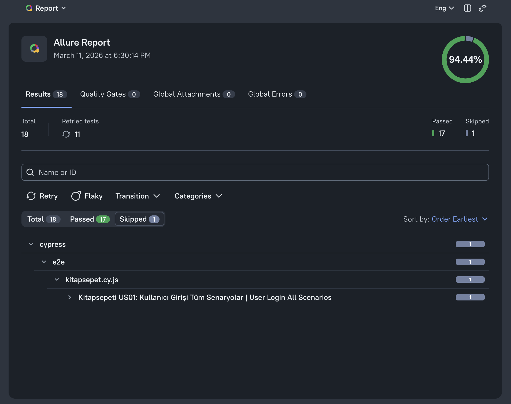
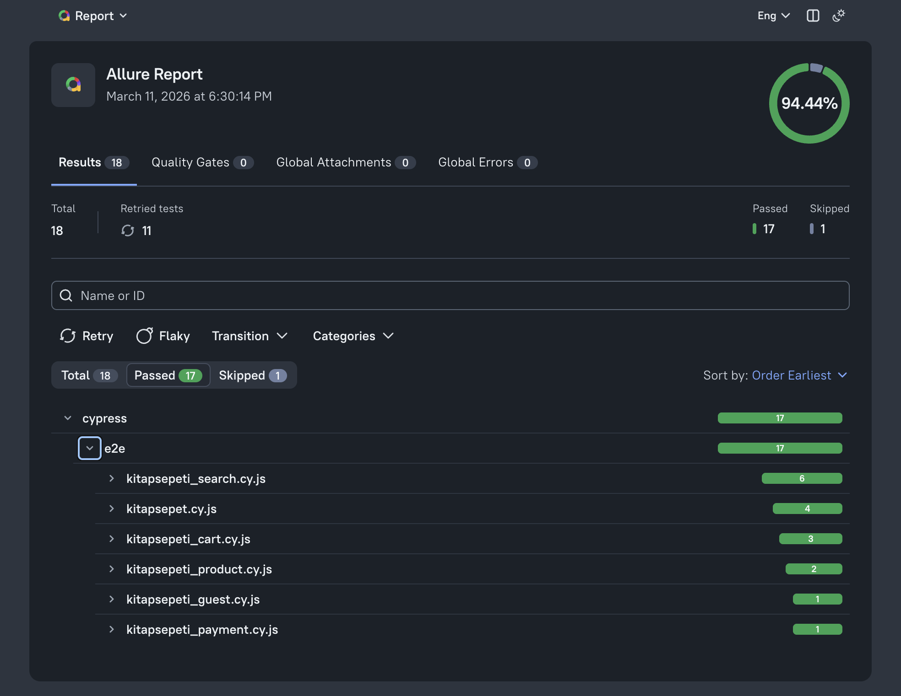
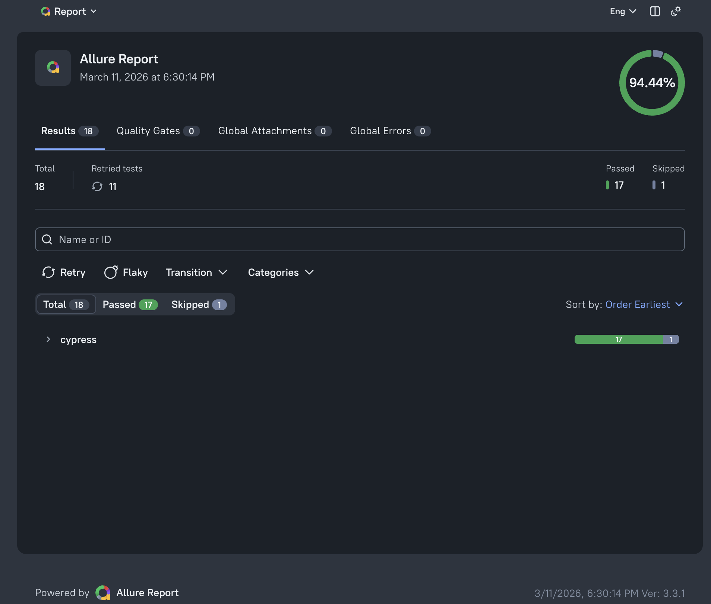

# Kitapsepeti.com E2E Test Automation Project

TR: Bu proje, Kitapsepeti.com sitesi için hazırlanmış, Page Object Model (POM) mimarisine sahip kapsamlı bir uçtan uca test otomasyon çalışmasıdır.
EN: This is a comprehensive E2E test automation project for Kitapsepeti.com, built with Page Object Model (POM) architecture.

---

## Test Raporları ve Kanıtlar | Test Reports & Evidences

  
 Allure Report Overview (Rapor Genel Görünümü)

   
  

    
    
    
  

---

### Senaryo Bazlı Test Videoları ve Ekran Görüntüleri

| Test Senaryosu | Ekran Görüntüsü (SS) | Uygulama Videosu |
| :--- | :---: | :---: |
| **Arama Fonksiyonu (Search)** | [Görüntüle](media/Search_Test_SS.png) | [İzle](media/Search_Test_Video.mov) |
| **Ürün Detay (Product)** | [Görüntüle](media/Product_Test_SS.png) | [İzle](media/Product_Test_Video.mov) |
| **Sepet Yönetimi (Cart)** | [Görüntüle](media/Cart_Test_SS.png) | [İzle](media/Cart_Test_Video.mov) |
| **Kullanıcı Girişi (Login)** | [Görüntüle](media/Login_Test_SS.png) | [İzle](media/Login_Test_Video.mov) |
| **Misafir Akışı (Guest)** | [Görüntüle](media/Guest_Test_SS.png) | [İzle](media/Guest_Test_Video.mov) |
| **Ödeme İşlemleri (Payment)** | [Görüntüle](media/Payment_Test_SS.png) | [İzle](media/Payment_Test_Video.mov) |

---

# 📚 Kitapsepeti.com E2E Test Automation Project

---

## 📋 Proje Kapsamı: User Stories & Acceptance Criteria (TR/EN)

  
🔐 User Story 01: Kullanıcı Girişi | User Login

   

| No | Acceptance Criteria (TR) | Acceptance Criteria (EN) | Status |
| :--- | :--- | :--- | :---: |
| **AC1** | Sağ üstteki giriş linki/ikonu ile erişim. | Access via top-right login link/icon. | ✅ |
| **AC2** | Form alanlarının (E-posta, Şifre vb.) kontrolü. | Validation of form fields (Email, Pass etc.). | ✅ |
| **AC3** | Doğru bilgilerle başarılı giriş. | Successful login with valid credentials. | ✅ |
| **AC4** | Giriş sonrası yönlendirme doğrulaması. | Redirection check after successful login. | ✅ |
| **AC5-7**| Hatalı/Boş bilgilerle negatif testler. | Negative tests with invalid/empty inputs. | ✅ |
| **AC8** | **[Kısıtlama]** 10 hatalı denemede IP kısıtı. | **[Limitation]** IP restriction after 10 attempts. | ⚠️* |

> **\*Not:** Site güvenliği (IP Ban) nedeniyle AC8 kontrollü test edilmiştir. / *AC8 was tested carefully due to site security (IP Ban).*
> **\*Not:** Giriş bilgileri değiştirilmiştir, test edilirken gerçek giriş bilgileri kullanılmalıdır. / Login credentials have been updated; actual credentials must be used during testing.

  
🔍 User Story 02: Ürün Arama | Product Search

   

| No | Acceptance Criteria (TR) | Acceptance Criteria (EN) | Status |
| :--- | :--- | :--- | :---: |
| **AC1-2** | Arama yapma ve sonuç sayfası kontrolü. | Performing search and result page check. | ✅ |
| **AC3** | Bulunmayan kelime araması (Negatif). | Searching for non-existing keywords. | ✅ |
| **AC4-5** | Ürün kartı bilgileri ve Sepete Ekle butonu. | Product card details and Add to Cart button. | ✅ |
| **AC6-7** | Sıralama ve filtreleme fonksiyonları. | Sorting and filtering functions. | ✅ |
| **AC9** | Sayfa sonu yeni ürün yüklenmesi (Scroll). | Infinite scroll: loading new products. | ✅ |

  
📖 User Story 03: Ürün Detay | Product Detail

   

| No | Acceptance Criteria (TR) | Acceptance Criteria (EN) | Status |
| :--- | :--- | :--- | :---: |
| **AC1** | Detay sayfasına yönlendirme. | Redirection to product details. | ✅ |
| **AC2-3** | Teknik bilgiler ve künye kontrolü. | Validation of technical specs and info. | ✅ |
| **AC4-5** | Sepete ekleme ve onay mesajı. | Adding to cart and success message. | ✅ |
| **AC6** | Sepet sayacı (Badge) güncellemesi. | Header cart counter (badge) update. | ✅ |

  
🛒 User Story 04: Sepet Yönetimi | Cart Management

   

| No | Acceptance Criteria (TR) | Acceptance Criteria (EN) | Status |
| :--- | :--- | :--- | :---: |
| **AC1-3** | Sepet sayfası erişimi ve fiyat doğruluğu. | Cart access and price accuracy. | ✅ |
| **AC4** | Ürün miktarı artırma ve anlık güncelleme. | Incrementing quantity and instant update. | ✅ |
| **AC5-7** | Ürün silme ve boş sepet kontrolü. | Removing items and empty cart validation. | ✅ |

  
💳 User Story 05: Ödeme Akışı | Payment Flow

   

| No | Acceptance Criteria (TR) | Acceptance Criteria (EN) | Status |
| :--- | :--- | :--- | :---: |
| **AC1-3** | Adres/Kargo adımları ve PTT Kargo seçimi. | Address/Cargo steps and PTT Cargo selection. | ✅ |
| **AC5-7** | Kredi kartı form doğrulaması (Poz/Neg). | Credit card form validation (Pos/Neg). | ✅ |

  
👤 User Story 06: Misafir Girişi | Guest Checkout

   

| No | Acceptance Criteria (TR) | Acceptance Criteria (EN) | Status |
| :--- | :--- | :--- | :---: |
| **AC1-2** | "Üye Olmadan Devam Et" butonu kontrolü. | "Continue as Guest" button check. | ✅ |
| **AC3-5** | Misafir form alanları ve hata uyarıları. | Guest form fields and error alerts. | ✅ |
| **AC6** | Başarılı form gönderimi ve ödemeye geçiş. | Successful submission and payment transition. | ✅ |

  
  <summary

---

## 🛠 Tech Stack | Kullanılan Teknolojiler

* **Framework:** Cypress 13+
* **Reporting:** Allure Report 3
* **Architecture:** Page Object Model (POM)
* **Language:** JavaScript

## ⚙️ How to Run | Nasıl Çalıştırılır?

1. **Install dependencies | Bağımlılıkları kurun:** `npm install`
2. **Run tests (with Allure) | Testleri başlatın (Allure ile):** `npx cypress run --env allure=true`
3. **View reports | Raporları görüntüleyin:** `npx allure serve allure-results`
